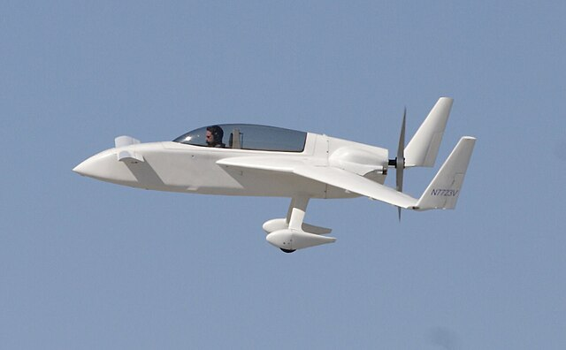

# Rutan VariEze Aerodynamic Parameters


*Stephen Kearney, CC BY-SA 4.0 <https://creativecommons.org/licenses/by-sa/4.0>, via Wikimedia Commons*

This dataset has CL, CD, and CM data for the VariEze and has this format:
    CL = [aoa(1) CL(1);aoa(2) CL(2);...]


Source: U of MN AEM3103 Spring 2023
        Professor Demoz Gebre-Egziabher


Sample Script for Loading and Plotting Data:

```matlab
%======================================================%
%   load_and_plot.m
%
%  This script loads in CL, CD and CM data for an the 
%  VariEze airplane and plots it.   The data files
%  containting CL, CD and CM have the following format.
%
%   CL = [aoa(1) CL(1);aoa(2) CL(2);...];
%
%  Demoz Gebre-Egziabher
%  February 8, 2023
%
%=======================================================%

%  Clear workspace

clc
close all;
clear variables;

%   Load in the data files

CL_data = load('VariEze_CL.txt');

%   Rename variables

aoa = CL_data(:,1);
CL = CL_data(:,2);

%   Plot the data

h1 = plot(aoa,CL,'rs');
grid on;
xlabel('\alpha (deg)')
ylabel('C_L')
set(h1,'MarkerFaceColor','r');
set(h1,'MarkerEdgeColor','k');
set(h1,'MarkerSize',12)
```
